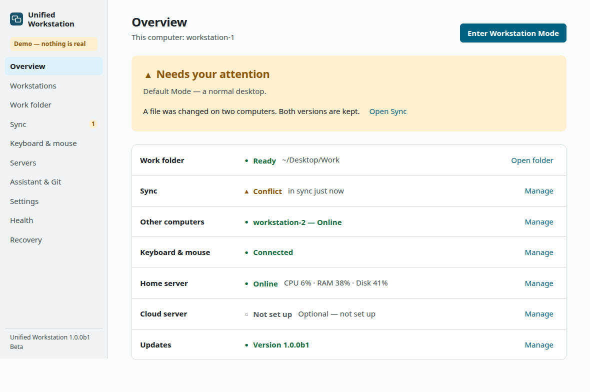
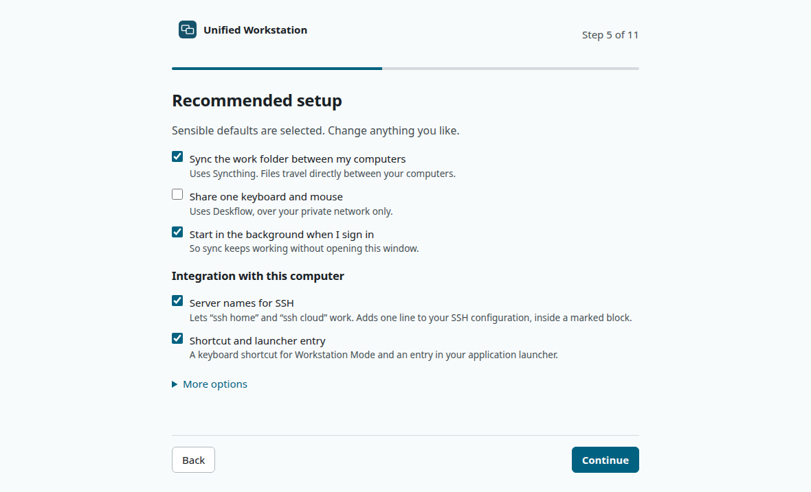
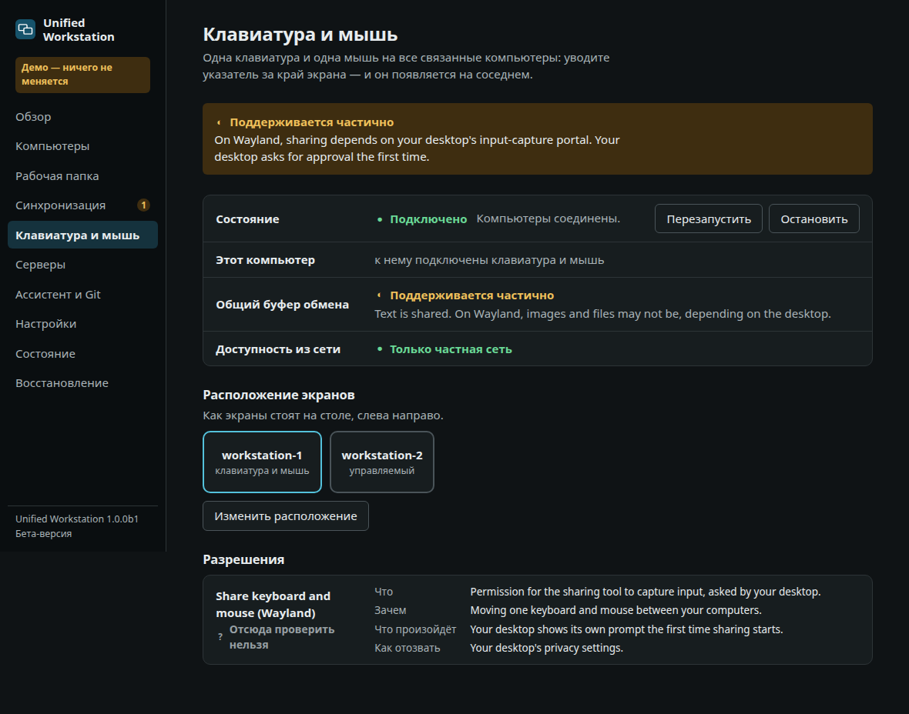

<div align="center">


# Unified Workstation

**Turn your computers into one coordinated workspace.**

One work folder that is the same everywhere · one keyboard and mouse across screens ·
servers with names instead of addresses · no account, no cloud service in the middle.

[Getting started](docs/getting-started.md) · [Installation](docs/installation.md) ·
[Documentation](docs/README.md) · [Supported platforms](docs/supported-platforms.md) ·
[Roadmap](ROADMAP.md)

`Linux` · `macOS` · `Windows` — **public beta 1.0.0b1**

</div>

> **Beta, stated plainly.** The automated test-suite passes on Linux x86_64. macOS and Windows
> are implemented and have CI jobs defined, but have not been run on real hardware yet, and
> signed installers do not exist until signing identities are configured. The
> [verification table](docs/supported-platforms.md#verification-status-version-100b1) says
> exactly what has evidence behind it. Nothing here is claimed without it.

## What it is

You work on more than one computer. Unified Workstation makes them feel like one:

| You want | You get |
|---|---|
| The same files on every computer | A **work folder** kept identical by [Syncthing](https://syncthing.net) — hidden files, project settings and all |
| One keyboard and mouse | Move the pointer off the edge of one screen onto the next computer ([Deskflow](https://deskflow.org)) |
| Copy here, paste there | A shared clipboard, and copying out of server sessions |
| An always-on copy | An optional **Home** server |
| Heavy compute, sometimes | An optional **Cloud** server that receives only the projects you choose |
| To know it works | An overview that answers one question: *am I ready to work?* |

Everything is set up in the application. You never edit a configuration file.

## Why it exists

Hardware changes; habits should not. A rented server gets a new address, a laptop is asleep,
Wi-Fi drops, a second computer arrives. None of that should mean remembering an address,
repairing a sync, or learning how four different tools are configured. The mature tools
already exist — this is the calm, honest layer that sets them up, watches them and tells you
in plain words when something needs you.

## Screenshots

<p align="center">
  
</p>
<p align="center">
  
  
</p>

*Taken in demo mode (`suw app --demo`): sample data only.*

## Quick start

1. **Download** the installer for your system from the release page
2. **Install** it — no terminal needed
3. **Open** Unified Workstation
4. **Get started** — choose *Personal computer* or *Workstation*
5. **Choose your work folder** (default: `Desktop/Work`)
6. **Pair** your other computer with a code and a six-digit confirmation number
7. **Done**

Until signed installers are published, run it from source — Python 3.11+, nothing else:

```sh
git clone https://github.com/ambartsumov/unified-workstation
cd unified-workstation
python3 bin/suw.py app --demo     # look around with sample data; touches nothing
python3 bin/suw.py app            # the real thing
```

## Features

- **First-run assistant** that shows every change before it makes it
- **Two modes only:** *Default* (a normal desktop, untouched) and *Workstation* (your tools, one step)
- **Explicit pairing** — nothing on your network is trusted automatically
- **Safe first sync** — folders are merged, conflicting files are kept twice, nothing is deleted silently
- **Honest capability detection** — every feature is *Supported*, *Partially supported*,
  *Needs permission*, *Not installed* or *Unavailable* on **your** machine, with the reason
- **Settings for everything**, validated before saving, with a snapshot before every change
- **Repair and recovery centre** — earlier file versions, earlier settings, rebuild, reset, export/import
- **Transactional Cloud replacement** — the old server stays active until the new one passed every check
- **Claude Code aware, not dependent** — shows which project context follows a project and which does not
- **Errors that answer** what happened, why, and what you can do
- **English and Russian**, light and dark, keyboard-navigable, no colour-only status
- **Demo mode** for trying, screenshots and contributors
- A full **command line** for those who want it — [advanced](docs/advanced/README.md)

## Platform support

| | Linux | macOS | Windows |
|---|---|---|---|
| Window, assistant, settings, pairing, sync, servers, recovery | ✓ | ✓ | ✓ |
| Shared keyboard and mouse | X11 ✓ · Wayland needs the input-capture portal | needs two permissions | not in administrator windows |
| Workstation Mode window placement | GNOME | with Hammerspoon | not implemented |
| Sending a project to Cloud | ✓ | known defect | needs an `rsync` |
| **Verified so far** | **automated tests, x86_64** | pending | pending |

Design limits and verification are two different columns for a reason — details in
[Supported platforms](docs/supported-platforms.md).

## Architecture

```text
application window · CLI
        │
core engine     workspace · settings · pairing · state · health · recovery · updates
        │
platform adapters        integrations
linux · macos · windows  Syncthing · Deskflow · Tailscale · SSH · Git · Claude Code
```

Python standard library only at runtime. The window is a small local page served to the system
web view over loopback — no framework, no build step, nothing loaded from the network.
More: [docs/architecture.md](docs/architecture.md).

## Privacy

No account. No telemetry. No analytics. The only request the application makes on its own is a
daily check of the public update manifest, which you can switch off.
[Privacy](docs/privacy.md)

## Security

Local-first; explicit trust for computers and servers; passwords in the operating system's
credential store, never in files; server identity checks that can not be switched off; a window
reachable from this computer only. [Security model](docs/security.md) ·
[Reporting a vulnerability](SECURITY.md)

## Roadmap

Signed installers for every platform, real-device acceptance, automatic update installation,
window placement beyond GNOME, a Home-replica button. [ROADMAP.md](ROADMAP.md)

## Contributing

`make demo` opens the window with fixtures; `make check` runs everything CI runs. No private
infrastructure is needed for anything. [CONTRIBUTING.md](CONTRIBUTING.md) ·
[Development guide](docs/development.md)

## Support

[Troubleshooting](docs/troubleshooting.md) · [FAQ](docs/faq.md) · [SUPPORT.md](SUPPORT.md)

## License

[MIT](LICENSE). Third-party tools the product works with are listed in
[THIRD_PARTY_NOTICES.md](THIRD_PARTY_NOTICES.md).
